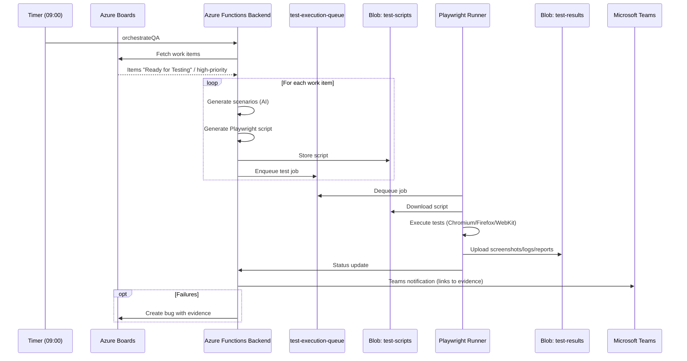

# QA Agent - Automated QA Workflow System

An intelligent, end-to-end QA automation system that integrates with Azure Boards, Azure Functions, OpenAI, Playwright, and Microsoft Teams to automate test generation, execution, and reporting.

## What It Does

QA Agent automates your entire daily QA workflow:

1. **Fetches Work Items** from Azure Boards that are ready for testing
2. **Generates Test Scenarios** using AI (3-5 exploratory scenarios per work item)
3. **Creates Automated Tests** - Generates Playwright test scripts for critical scenarios
4. **Executes Tests** in Docker containers with screenshot and log capture
5. **Stores Evidence** - Screenshots, logs, and reports in Azure Blob Storage
6. **Notifies Stakeholders** - Sends Teams notifications with test results and evidence
7. **Creates Bugs** - Optionally creates Azure Boards bugs for failed tests
8. **Daily Summaries** - Provides comprehensive daily QA reports

## How It Works

### Architecture Overview

```mermaid
flowchart LR
  User[User/QA] --> Frontend[React Frontend\n(port 3000)]
  Frontend -->|REST| Backend[Azure Functions Backend\n(local: 7071)]

  AzureBoards[Azure Boards] -->|Work items| Backend

  subgraph Storage
    Scripts[(Blob: test-scripts)]
    Results[(Blob: test-results)]
    ExecQueue[(Queue: test-execution-queue)]
    GenQueue[(Queue: test-generation-queue)]
    StatusQueue[(Queue: job-status-queue)]
  end

  Backend -->|Generate & store scripts| Scripts
  Backend -->|Enqueue jobs| ExecQueue
  Backend -->|Enqueue work items| GenQueue

  Runner[Playwright Runner\n(Docker)] -->|Download scripts| Scripts
  ExecQueue -->|Trigger| Runner
  Runner -->|Upload results| Results
  Runner -->|Status updates| StatusQueue

  Backend -->|Notify| Teams[Microsoft Teams]
  Backend -->|Query results| Results

  note right of Results: Local development uses Azurite
```

#### Service Topology (docker-compose)

```mermaid
flowchart TB
  subgraph docker-compose
    FE[frontend\n:3000]:::svc
    BE[backend (Azure Functions)\n7071->80]:::svc
    RUN[runner\n(tests)]:::svc
    AZ[azurite\n10000/10001/10002]:::svc
  end

  FE -->|API calls| BE
  BE -->|UseDevelopmentStorage=true| AZ
  RUN -->|Reads/Writes blobs & queues| AZ
  RUN -->|Tests against| FE

  classDef svc fill:#f6f8fa,stroke:#d0d7de,color:#24292f
```

### Workflow Sequence



## Project Structure

```
.
├── backend/                    # Azure Functions backend
│   ├── api/
│   │   ├── fetchWorkItems/    # Fetches work items from Azure Boards
│   │   ├── generateTests/     # Generates Playwright tests using AI
│   │   ├── runTests/          # Executes tests in Docker containers
│   │   ├── jobStatus/         # HTTP endpoint for test status queries
│   │   └── orchestrateQA/     # Main QA workflow orchestration
│   ├── shared/
│   │   ├── queue.js          # Azure Storage Queue helper
│   │   ├── storage.js        # Azure Blob Storage helper
│   │   ├── teams.js          # Teams notifications and bug creation
│   │   └── qa-workflow/      # QA workflow helper modules
│   └── package.json
│
├── frontend/                  # React frontend application
│   ├── src/
│   │   ├── components/       # React components
│   │   ├── services/         # API service layer
│   │   └── App.js           # Main application
│   └── package.json
│
├── runner/                    # Playwright Docker runner
│   ├── Dockerfile            # Docker image definition
│   ├── entrypoint.sh         # Container entrypoint
│   └── sample-test.spec.js   # Sample test script
│
├── infra/                     # Azure Infrastructure as Code
│   ├── main.bicep           # Bicep template
│   └── parameters.json     # Deployment parameters
│
├── .devcontainer/            # Development container setup
│   ├── devcontainer.json    # VS Code dev container config
│   └── Dockerfile           # Dev container image
│
├── .github/workflows/        # GitHub Actions CI/CD
│   └── deploy.yml          # Deployment workflow
│
└── docker-compose.yml        # Local development orchestration
```

## How to Run

### Prerequisites

- **Node.js 20+**
- **Azure Account** with subscription
- **Azure DevOps** account with Personal Access Token (PAT)
- **OpenAI API Key** or Azure OpenAI resource
- **Docker** (for local development and test execution)
- **Azure Functions Core Tools** (for local Function App development)
- **Azure CLI** (for infrastructure deployment)

### Quick Start (Local Development)

#### 1. Clone and Setup

```bash
# Clone the repository
git clone <repository-url>
cd qa-agent

# Copy environment template
cp .env.example .env

# Edit .env with your configuration
# - Azure Storage connection string
# - Azure DevOps credentials
# - OpenAI API key
# - Teams webhook URL
```

#### 2. Start Development Environment

**Option A: Using Docker Compose (Recommended)**

```bash
# Start all services
docker-compose up

# Services will be available at:
# - Frontend: http://localhost:3000
# - Backend: http://localhost:7071
# - Azurite (Storage Emulator): http://localhost:10000
```

**Option B: Using VS Code Dev Container**

1. Open the project in VS Code
2. When prompted, click "Reopen in Container"
3. VS Code will build and start the dev container
4. All services will be configured automatically

**Option C: Manual Setup**

```bash
# Backend
cd backend
npm install
func start

# Frontend (in another terminal)
cd frontend
npm install
npm start

# Azurite (Azure Storage Emulator)
docker run -d -p 10000:10000 -p 10001:10001 -p 10002:10002 \
  mcr.microsoft.com/azurite
```

#### 3. Configure Environment Variables

Create `backend/local.settings.json`:

```json
{
  "IsEncrypted": false,
  "Values": {
    "AzureWebJobsStorage": "UseDevelopmentStorage=true",
    "FUNCTIONS_WORKER_RUNTIME": "node",
    "AZURE_STORAGE_CONNECTION_STRING": "DefaultEndpointsProtocol=http;AccountName=devstoreaccount1;AccountKey=Eby8vdM02xNOcqFlqUwJPLlmEtlCDXJ1OUzFT50uSRZ6IFsuFq2UVErCz4I6tq/K1SZFPTOtr/KBHBeksoGMGw==;BlobEndpoint=http://localhost:10000/devstoreaccount1;QueueEndpoint=http://localhost:10001/devstoreaccount1;",
    "AZURE_DEVOPS_ORG_URL": "https://dev.azure.com/yourorg",
    "AZURE_DEVOPS_PROJECT": "YourProject",
    "AZURE_DEVOPS_PAT": "your-pat-token",
    "OPENAI_API_KEY": "your-openai-key",
    "TEAMS_WEBHOOK_URL": "https://outlook.office.com/webhook/..."
  }
}
```

### Production Deployment

#### 1. Deploy Infrastructure

```bash
# Login to Azure
az login
az account set --subscription "Your Subscription"

# Create resource group
az group create --name rg-qa-agent-prod --location eastus

# Deploy infrastructure
cd infra
az deployment group create \
  --resource-group rg-qa-agent-prod \
  --template-file main.bicep \
  --parameters @parameters.json \
  --parameters environment=prod
```

#### 2. Configure Function App Settings

```bash
# Get Function App name from deployment output
FUNCTION_APP=$(az deployment group show \
  --resource-group rg-qa-agent-prod \
  --name qa-agent-deployment \
  --query properties.outputs.functionAppName.value -o tsv)

# Set environment variables
az functionapp config appsettings set \
  --resource-group rg-qa-agent-prod \
  --name $FUNCTION_APP \
  --settings \
    AZURE_DEVOPS_ORG_URL="https://dev.azure.com/yourorg" \
    AZURE_DEVOPS_PROJECT="YourProject" \
    AZURE_DEVOPS_PAT="your-pat-token" \
    OPENAI_API_KEY="your-openai-key" \
    TEAMS_WEBHOOK_URL="https://outlook.office.com/webhook/..."
```

#### 3. Build and Push Docker Image

```bash
# Get ACR name
ACR_NAME=$(az deployment group show \
  --resource-group rg-qa-agent-prod \
  --name qa-agent-deployment \
  --query properties.outputs.containerRegistryName.value -o tsv)

# Login to ACR
az acr login --name $ACR_NAME

# Build and push runner image
cd runner
az acr build --registry $ACR_NAME --image playwright-runner:latest .
```

#### 4. Deploy Function App Code

```bash
cd backend
func azure functionapp publish $FUNCTION_APP
```

#### 5. Using GitHub Actions (CI/CD)

1. Configure GitHub Secrets:
   - `AZURE_CREDENTIALS` - Azure service principal JSON
   - `AZURE_RG_NAME` - Resource group name
   - `AZURE_DEVOPS_ORG_URL`, `AZURE_DEVOPS_PROJECT`, `AZURE_DEVOPS_PAT`
   - `OPENAI_API_KEY` or `AZURE_OPENAI_API_KEY`
   - `TEAMS_WEBHOOK_URL`

2. Push to main branch - workflow will automatically:
   - Run CI tests
   - Deploy infrastructure
   - Build and push Docker image
   - Deploy Function App

### Manual Testing

#### Test Work Item Fetching

```bash
# Trigger fetchWorkItems function manually
curl -X POST http://localhost:7071/admin/functions/fetchWorkItems
```

#### Test Test Generation

Enqueue a message to test-generation-queue:

```bash
# Using Azure Storage Explorer or Azure CLI
az storage queue message put \
  --connection-string "your-connection-string" \
  --queue-name test-generation-queue \
  --content '{"workItemId":"1234","title":"Test Feature","description":"Test Description"}'
```

#### Query Test Status

```bash
curl "http://localhost:7071/api/jobStatus?testId=your-test-id"
```

### Scheduling the QA Workflow

The `orchestrateQA` function runs on a schedule (default: weekdays at 9 AM).

To modify the schedule, edit `backend/api/orchestrateQA/function.json`:

```json
{
  "schedule": "0 0 9 * * 1-5"  // Weekdays at 9 AM
}
```

Cron format examples:
- `0 0 9 * * 1-5` - Weekdays at 9 AM
- `0 */6 * * *` - Every 6 hours
- `0 0 * * *` - Daily at midnight

## Configuration

### Required Environment Variables

| Variable | Description | Example |
|----------|-------------|---------|
| `AZURE_STORAGE_CONNECTION_STRING` | Azure Storage connection string | `DefaultEndpointsProtocol=https;AccountName=...` |
| `AZURE_DEVOPS_ORG_URL` | Azure DevOps organization URL | `https://dev.azure.com/yourorg` |
| `AZURE_DEVOPS_PROJECT` | Azure DevOps project name | `YourProject` |
| `AZURE_DEVOPS_PAT` | Personal Access Token | `your-pat-token` |
| `OPENAI_API_KEY` or `AZURE_OPENAI_API_KEY` | OpenAI API key | `sk-...` or Azure OpenAI key |
| `TEAMS_WEBHOOK_URL` | Microsoft Teams webhook URL | `https://outlook.office.com/webhook/...` |

### Optional Environment Variables

| Variable | Description | Default |
|----------|-------------|---------|
| `AZURE_OPENAI_ENDPOINT` | Azure OpenAI endpoint | - |
| `AZURE_OPENAI_MODEL` | Model name | `gpt-4` |
| `STORAGE_CONTAINER_NAME` | Test scripts container | `test-scripts` |
| `RESULTS_CONTAINER_NAME` | Test results container | `test-results` |
| `QA_JOBS_QUEUE_NAME` | QA jobs queue name | `test-generation-queue` |
| `CREATE_BUGS_FOR_FAILURES` | Auto-create bugs for failures | `false` |
| `BASE_URL` | Application URL for tests | `http://localhost:3000` |

## Key Features

- **AI-Powered Test Generation**: Uses OpenAI/Azure OpenAI to generate exploratory scenarios and Playwright scripts
- **Automated Workflow**: End-to-end automation from work item to test results
- **Evidence Capture**: Automatic screenshot, log, and report capture
- **Teams Integration**: Rich notifications with evidence links
- **Azure Boards Integration**: Fetches work items and creates bugs
- **Docker-Based Execution**: Isolated test execution in containers
- **Scalable Architecture**: Serverless Azure Functions with consumption plan
- **CI/CD Ready**: GitHub Actions workflow for automated deployment

## Documentation

- [Backend Documentation](backend/README.md) - Detailed backend documentation
- [Frontend Documentation](frontend/README.md) - Frontend application guide
- [Infrastructure Documentation](infra/README.md) - Infrastructure deployment guide
- [Dev Container Documentation](.devcontainer/README.md) - Development environment setup
- [GitHub Actions Documentation](.github/workflows/README.md) - CI/CD pipeline guide

## Troubleshooting

### Common Issues

**Work items not being fetched:**
- Verify Azure DevOps PAT has correct permissions
- Check work item status matches exactly ("Ready for Testing")
- Verify project name is correct

**Tests not generating:**
- Verify OpenAI API key is valid
- Check API quota/limits
- Verify model name is available

**Tests not executing:**
- Verify Docker is running (for local development)
- Check test-execution-queue exists
- Verify runTests function is deployed

**Teams notifications not sending:**
- Verify webhook URL is correct and not expired
- Check Teams connector permissions

## Contributing

1. Fork the repository
2. Create a feature branch
3. Make your changes
4. Run tests and linting
5. Submit a pull request

## License

ISC

## Support

For issues and questions:
- Check the documentation in each module's README
- Review Azure Functions logs
- Check Teams notifications for error messages
- Verify environment variables are set correctly
